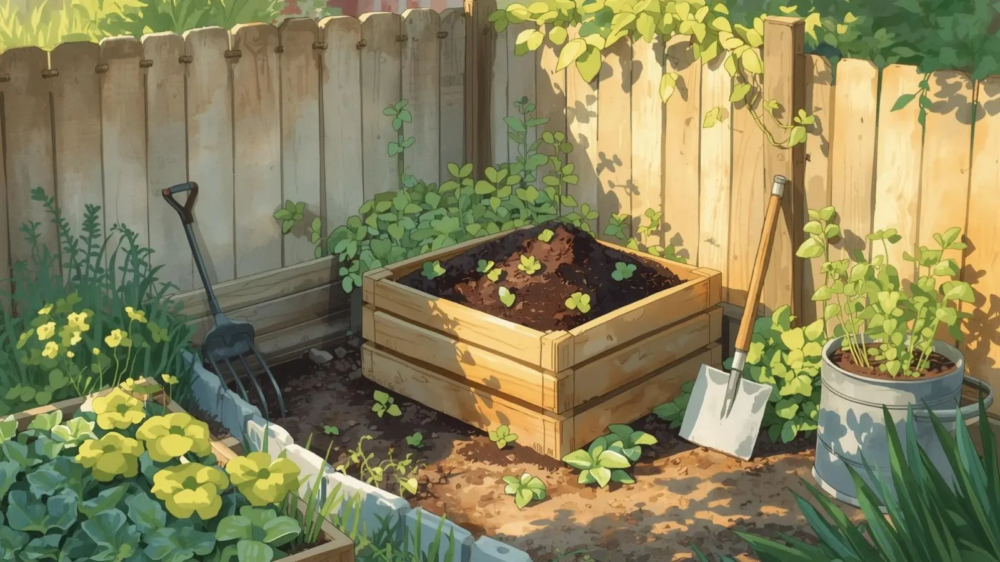

## A co Ty z tym wszystkim robisz? Czyli jak śmieci zamieniają się w złoto

Znasz to. Stoisz przy działce, coś tam przycinasz, trochę chwastów w wiadrze, trochę obierek po obiedzie, a sąsiad zza płotu zagląda i pyta: „A co Ty z tym wszystkim robisz?”. No właśnie — co?

Jedni pakują do worka i do śmietnika. Inni wynoszą gdzieś „za płot”, co niby rozwiązuje problem, ale tylko na chwilę. A jeszcze inni — i to jest ta spokojniejsza, bardziej działkowa szkoła życia — wrzucają wszystko do jednego miejsca i… czekają.

To „czekanie” to właśnie kompostowanie. Niby nic wielkiego, a tak naprawdę jedna z najprostszych i najbardziej sensownych rzeczy, jakie można zrobić na działce. Zresztą w regulaminie ROD nie bez powodu pojawia się obowiązek posiadania kompostownika — to mniej śmieci i więcej pożytku z każdej garści zielonych odpadów.

## Co to jest kompost i po co komu?

Na pierwszy rzut oka kompost to po prostu kupa resztek. Liście, trawa, obierki, trochę ziemi, czasem coś bardziej „podejrzanego”. Wygląda to jak bałagan, który ktoś zostawił i zapomniał sprzątnąć.

Ale jak dasz temu trochę czasu, zaczyna się coś ciekawego. To wszystko powoli się rozkłada, miesza, zmienia kolor i zapach. Z tej chaotycznej mieszanki robi się coś, co przypomina dobrą, żyzną ziemię — ciemną, lekko wilgotną, pachnącą lasem.

To właśnie kompost. Taki naturalny „recykling” działkowy.

Z punktu widzenia roślin to jest prawdziwe złoto. Nie dlatego, że działa jak jakiś cudowny nawóz z reklamy, tylko dlatego, że poprawia glebę od środka. Ziemia robi się bardziej pulchna, lepiej trzyma wodę, a jednocześnie nie zamienia się w beton po deszczu.

Można to porównać do kuchni. Jak gotujesz z dobrych składników, to nawet proste danie wychodzi smaczne. Kompost to właśnie te „dobre składniki” dla ziemi — naturalny, darmowy nawóz, którym trudno rośliny przenawozić.

## Pryzma, dół czy skrzynka – każdy robi po swojemu

Na działkach nie ma jednej szkoły kompostowania. I dobrze, bo każdy ma trochę inne warunki.

Najprostsza forma to pryzma. Po prostu wybierasz kawałek miejsca i zaczynasz odkładać wszystko w jedno miejsce. Bez konstrukcji, bez kombinowania. Działa, szczególnie jak masz więcej przestrzeni i nie przeszkadza Ci widok „działkowej góry”.

Niektórzy wolą dół kompostowy. Kopiesz, wrzucasz, przykrywasz ziemią. To rozwiązanie ma swój urok — mniej widać, mniej czuć, wszystko jakby „samo się robi”. Z drugiej strony, jak dół jest zbyt mokry, to potrafi się zrobić z tego kiszonka, a nie kompost.

Są też klasyczne kompostowniki — drewniane skrzynki, plastikowe pojemniki, czasem całkiem estetyczne konstrukcje. One mają tę zaletę, że wszystko trzyma się w ryzach. Łatwiej kontrolować wilgotność, łatwiej przerzucać, no i wygląda to bardziej „porządnie”. W wielu ROD-ach właśnie taki kompostownik jest wskazywany jako podstawowe wyposażenie działki.

No i jest jeszcze wermikompost, czyli kompostowanie z pomocą dżdżownic. Brzmi trochę egzotycznie, ale w praktyce to bardzo sprytny system. Dżdżownice robią za pracowników, którzy dzień i noc przerabiają resztki na świetnej jakości kompost. Wymaga to trochę więcej uwagi, ale efekty są naprawdę dobre.

Prawda jest taka, że nie ma jednej „najlepszej” metody. Ważne, żeby coś robić, a nie szukać idealnego rozwiązania przez dwa sezony.

## Typowe problemy, czyli kiedy kompost zaczyna żyć własnym życiem

Kompost jest wdzięczny, ale jak się go całkiem zostawi samemu sobie, potrafi pokazać charakter.

Najczęstszy problem to zapach. Jeśli coś zaczyna pachnieć jak stare śmieci w upalny dzień, to znak, że w środku jest za mokro i za mało powietrza. Mówiąc prosto — kompost się „dusi”.

Czasem ludzie wrzucają za dużo resztek kuchennych naraz. Obierki, jedzenie, coś jeszcze… i robi się z tego taka ciężka, mokra masa. To trochę jak w kuchni — jak przesadzisz z jednym składnikiem, całe danie się rozjeżdża.

Z drugiej strony bywa odwrotnie. Sama sucha trawa, liście, gałęzie — i wszystko stoi w miejscu. Nic się nie dzieje, tylko wysycha i leży. Kompost potrzebuje równowagi, trochę wilgoci, trochę „życia”.

No i klasyka: ktoś zapomni, że to w ogóle istnieje. Pryzma rośnie, zarasta chwastami, a po roku nikt nie wie, co jest w środku. Kompost zaczyna „żądać przestrzeni” i powoli przejmuje kontrolę nad kawałkiem działki.

## Jak nie udusić kompostu?

Nie trzeba być ekspertem, żeby kompost działał. Wystarczy kilka prostych zasad, które z czasem wchodzą w nawyk.

Przede wszystkim — mieszanie. Kompost lubi, kiedy się go od czasu do czasu „przetasuje”. Jak w bigosie — jak tylko stoi, to się kisi, jak go ruszysz, zaczyna pracować. Wystarczy raz na jakiś czas przerzucić widłami, żeby wpuścić powietrze do środka.

Druga sprawa to równowaga między tym, co mokre i tym, co suche. Jak wrzucasz obierki czy świeżą trawę, dobrze dorzucić trochę suchych liści, kartonu albo drobnych gałązek. To działa jak ręcznik — wchłania nadmiar wilgoci i daje strukturę.

Woda też ma znaczenie. Latem kompost potrafi wyschnąć na wiór, szczególnie w otwartej pryzmie. Wtedy warto go lekko podlać, ale bez przesady. To ma być wilgotne jak gąbka, a nie jak błoto po deszczu.

Dobrze też pamiętać, że nie wszystko się nadaje. Resztki mięsne, tłuste jedzenie czy duże ilości chleba potrafią narobić więcej problemów niż pożytku. Przyciągają nieproszonych gości i psują cały proces.

I jeszcze jedna rzecz, o której wiele osób zapomina — czas. Kompost to nie jest ekspres do kawy. To działa w swoim tempie. Jak coś po trzech tygodniach wygląda „tak sobie”, to jest normalne.

## Na koniec – bez spinania się

Kompostowanie na działce to nie jest egzamin. To raczej proces, którego się uczysz w praktyce. Każda działka jest trochę inna, każda pryzma zachowuje się inaczej.

Pierwszy kompost rzadko wychodzi idealny. Może być za mokry, za suchy, może trochę śmierdzieć albo się wlec. I to jest w porządku. Najważniejsze, że działa — że z czegoś, co normalnie byś wyrzucił, powstaje coś, co wraca do ziemi i robi robotę.

Po jednym sezonie zaczynasz już widzieć różnicę. Ziemia lepiej wygląda, rośliny jakoś „chętniej rosną”, a Ty masz mniej do wyrzucania.

I wtedy ten sam sąsiad zza płotu znowu zapyta: „A co Ty z tym wszystkim robisz?”.  
A Ty już będziesz wiedział, co odpowiedzieć — i pewnie jeszcze dorzucisz: „Zrób sobie też. Zobaczysz, jaka to wygoda.”