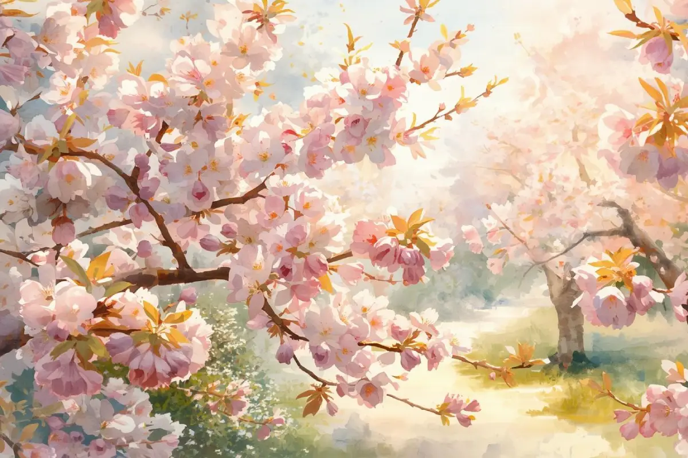
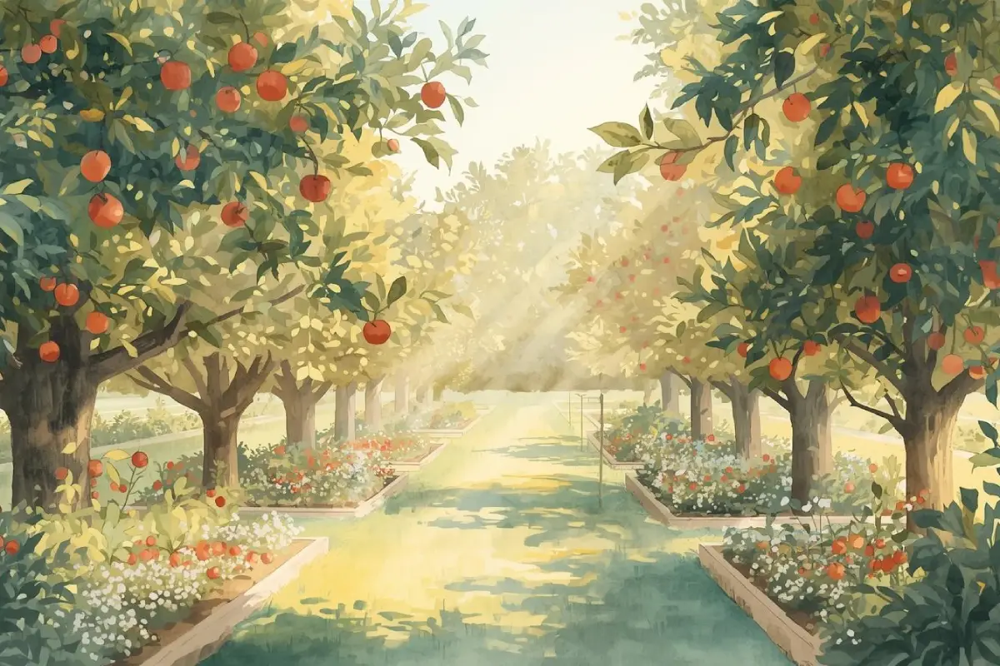

Powiem Ci wprost — największy błąd działkowców to próba ogarnięcia wszystkiego naraz.

Każdy coś doradzi. Każdy ma „złoty środek”. A potem stoisz z opryskiwaczem i nie wiesz: **lać czy czekać**?

Dlatego zróbmy to normalnie.

Masz tu prosty, sprawdzony plan: co robić od wiosny do lata — drzewa, krzewy, winorośl, truskawki i nawet trawnik.

Bez przesady. Bez chemii na zapas. Z głową.

> Uwaga: zawsze sprawdzaj aktualną etykietę środka, dawki i okres karencji. Poniżej masz przykładowe preparaty, a nie „jedyną słuszną” listę.

## Kwiecień – wszystko rusza

To moment, kiedy zaczyna się sezon… i najłatwiej coś zepsuć.

### Drzewa owocowe w kwietniu (wiśnie, czereśnie, śliwy, jabłonie)

Jeśli drzewa kwitną, robisz oprysk **tylko na choroby**:

- np. Switch 62,5 WG (cyprodynil + fludioksonil) — fungicyd zapobiegawczy i interwencyjny m.in. na szarą pleśń i brunatną zgniliznę kwiatów, stosowany w czasie kwitnienia zgodnie z etykietą.

Dlaczego?

Bo największe zagrożenie to teraz infekcje kwiatów. Jak to przegapisz, owoce mogą zgnić, zanim zdążą urosnąć.

❗ **Na robaki NIE pryskasz.**  
Pszczoły robią robotę za Ciebie — nie przeszkadzaj im.

### Winorośl w kwietniu

Tu zaczyna się zabawa:

- pierwszy oprysk: Siarkol 80 WG (siarka) — klasyka na mączniaka prawdziwego,
- potem powtarzasz co 10–14 dni, w zależności od pogody i zaleceń z etykiety.

To zabezpiecza przed mączniakiem, który potrafi zniszczyć krzak w jeden sezon.

### Truskawki na starcie

Na początku sezonu:

- nic nie pryskasz,
- usuwasz stare liście (po zimie),
- robisz porządek w rzędach, rozluźniasz zbyt gęste miejsca.

Im mniej wilgoci i bałaganu — tym mniej chorób.

### Trawnik na wiosnę

Tu możesz działać od razu:

- pierwsze koszenie,
- lekka dawka mocznika (klasyczny mocznik ogrodniczy lub nawóz azotowy do trawników),
- podlewanie, jeśli jest sucho.

Po kilku dniach trawa robi się intensywnie zielona i widać efekt.

## Koniec kwietnia / maj – kluczowy moment

To jest etap, który **robi sezon**.

### Jabłonie po kwitnieniu

Po opadzie płatków:

- oprysk na parch: np. Syllit 65 WP (dodyna),
- oprysk na robaki: np. Mospilan 20 SP (acetamipryd).

To jeden z niewielu momentów, gdzie ma sens „kombinacja” fungicyd + insektycyd w jednym zabiegu (oczywiście zgodnie z etykietą obu środków).

### Pestkowe: wiśnie i śliwy

Tu zasada jest prosta: **działasz tylko, jeśli jest problem**.

- choroby liści / brunatna zgnilizna → np. Signum 33 WG (boskalid + piraklostrobina),
- robaki (np. nasionnice, owocówki) → np. Mospilan 20 SP.

Jeśli jest sucho, przewiewnie, a drzewa wyglądają zdrowo — odpuszczasz.

### Truskawki w maju

Jeśli jest wilgotno, duża presja chorób:

- możesz zapobiegawczo dać coś na szarą pleśń, np. Switch 62,5 WG albo Signum 33 WG (zgodnie z etykietą).

Jeśli jest sucho:

- nic nie robisz, tylko podlewasz z głową i dbasz o przewiewność.

Większość problemów z truskawką to **wilgoć**, nie brak oprysków.

### Winorośl w maju

Dalej jedziesz:

- Siarkol 80 WG co 10–14 dni,
- jeśli leje non stop i jest ciepło, można dorzucić coś mocniejszego na mączniaka, np. Topas 100 EC (penkonazol).

Tu ważniejsza jest **regularność** niż „rakieta chemiczna”.

### Trawnik w maju

- koszenie mniej więcej co tydzień,
- ewentualnie druga dawka nawozu (np. nawóz do trawników z azotem).

I naprawdę — **nie trzeba więcej**.

## Czerwiec – owoce rosną

Zaczynają się konkretne problemy, ale też nie ma sensu panikować.

### Jabłonie w czerwcu

- jeśli pojawiają się robaki (robaczywe zawiązki, uszkodzenia) → oprysk, np. Mospilan 20 SP,
- jeśli jest czysto → nie ruszasz.

Nie pryskasz „na zapas”, tylko w reakcji na realny problem.

### Czereśnie – najważniejszy moment

Najważniejszy moment jest wtedy, gdy owoce zaczynają żółknąć:

- robisz oprysk przeciw nasionnicy (tzw. robak w czereśni), np. Mospilan 20 SP zgodnie z etykietą.

Jak to przegapisz — robaki masz w środku i już tego nie cofniesz.

### Truskawki w czerwcu

- zbierasz owoce na bieżąco,
- usuwasz chore, spleśniałe i zgniłe owoce z rzędu, nie zostawiasz ich przy roślinie.

Tu mniej filozofii, więcej **patrzenia na grządki**.

### Winorośl w czerwcu

- dalej pilnujesz mączniaka: Siarkol 80 WG lub Topas 100 EC,
- patrzysz na liście i grona, reagujesz na pierwsze objawy, a nie wtedy, gdy połowa krzewu jest biała.

Regularność ważniejsza niż „moc” środka.

### Dokarmianie wapniem

W czerwcu możesz zacząć **nawożenie wapniem**:

- np. Metalosate Calcium, Calcinit albo inne nawozy wapniowe dolistne.

Poprawia to jakość owoców, zmniejsza problemy z przechowywaniem i pękaniem.

## Lipiec – luz, ale czujność

To moment, gdzie wielu ludzi dalej pryska „bo tak”.  
Nie rób tego.

- **nie ma problemu → nie ma oprysku**,
- są objawy → reagujesz, dobierasz środek pod konkretną sytuację.

Proste.

## Jesień – mało kto o tym pamięta

Jeden z najważniejszych zabiegów na **przyszły rok**:

- oprysk mocznikiem (ok. 5%) na opadające liście jabłoni.

Taki zabieg mocno ogranicza zimowanie zarodników parcha i innych chorób, więc w kolejnym sezonie masz **mniej kłopotów** z samych jabłoni.

## Najważniejsze zasady (zapamiętaj)

1. **Nie pryskaj „bo ktoś tak robi”**  
   Oprysk ma sens tylko wtedy, gdy:
   - jest wilgoć i warunki sprzyjające chorobom,
   - są realne objawy,
   - masz kluczowy moment w sezonie (kwitnienie, tuż po kwitnieniu, pierwsze pojawienie się szkodnika).

2. **Mniej znaczy więcej**  
   - 3–4 dobrze trafione opryski,  
   - zamiast 10 przypadkowych, „bo sąsiad coś leje”.

3. **Wieczór to Twój czas**  
   - pszczoły już nie latają,
   - nie ma ostrego słońca,
   - oprysk działa lepiej i bezpieczniej dla pożytecznych owadów.

4. **Obserwacja > kalendarz**  
   - każdy rok jest inny,
   - nie patrz tylko w kartkę, patrz na drzewa, liście, owoce i pogodę.

## Na koniec

Działka to nie sad towarowy.

Nie musisz robić wszystkiego „książkowo”.

Wystarczy, że trafisz w kilka momentów:

- kwitnienie,
- tuż po kwitnieniu,
- pierwsze pojawienie się robaków.

I będziesz mieć plon lepszy niż większość.

Reszta to tylko dodatki.

---

Jeśli chcesz, w następnym wpisie pokażę:

👉 jak rozpoznać choroby i szkodniki po samych liściach i owocach — na zdjęciach, bez zgadywania.

To jest moment, w którym zaczyna się **prawdziwa kontrola nad działką**.
